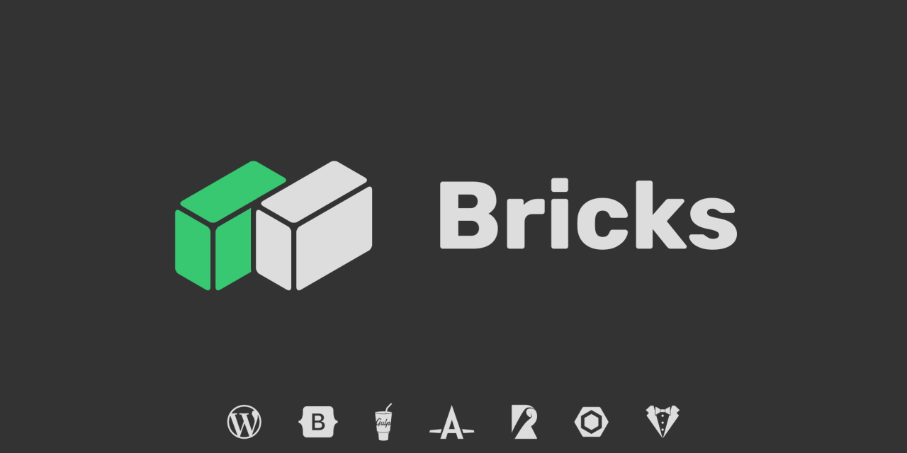

_A modular WordPress starter theme powered by Bootstrap 5 and Gulp_

[Documentation](https://bricks.stefanobartoletti.it/) | [Changelog](https://github.com/stefanobartoletti/bricks/blob/master/CHANGELOG.md)

---

## 🌟 Features

- [Bootstrap 5](https://getbootstrap.com/) (compiled from source Sass and JavaScript files)
- [WP Bootstrap Navwalker](https://github.com/wp-bootstrap/wp-bootstrap-navwalker)
- Custom [Gulp](https://gulpjs.com/) tasks
- [Font Awesome 5](https://fontawesome.com/) (*SVG with JavaScript* version, parsed and minified by [gulp-fa-minify](https://github.com/FA-Minify/gulp-fa-minify))
- CSS bundling, including [Autoprefixer](https://autoprefixer.github.io/) and [PurgeCSS](https://purgecss.com/)
- JavaScript bundling with [Rollup](https://www.rollupjs.org/) and [Babel](https://babeljs.io/)
- Code linting with [ESLint](https://eslint.org/), [Stylelint](https://stylelint.io/) and [phpcs](https://github.com/squizlabs/PHP_CodeSniffer).
- [BrowserSync](https://www.browsersync.io/) live server.
- Automatic conversion of custom fonts into *woff2* web format
- Pre-localized templates in several languages ( 🇨🇿 Czech | 🇫🇷 French | 🇩🇪 German | 🇮🇹 Italian | 🇱🇹 Lithuanian | 🇪🇸 Spanish )
- Support for further localization by generation of a `.pot` [template file](https://developer.wordpress.org/themes/functionality/internationalization/)
- Support for integration of some optional JavaScript libraries

## ✅ Requirements

- [Git](https://git-scm.com/) to clone this repository.
- [Yarn](https://yarnpkg.com/) as the preferred tool to manage dependencies and run development scripts (you can also use plain [npm](https://nodejs.org/)).
- [Composer](https://getcomposer.org/) to manage PHP dependencies (Optional, used for PHP linting).
- [Advanced Custom Fields](https://www.advancedcustomfields.com/) (Regular or PRO) to take advantage of its integration with Bricks (Optional but strongly recommended).

## 📖 Documentation

Installation and configuration instructions and all features are documented on the [Bricks Documentation](https://bricks.stefanobartoletti.it/) website.

## 📃 Changelog

All updates up to the latest released version are documented in the [Changelog](https://github.com/stefanobartoletti/bricks/blob/master/CHANGELOG.md) file.

## 🤝 Contributing

If you want to contribute to Bricks make sure to read the [Contributing guidelines](https://github.com/stefanobartoletti/bricks/blob/master/.github/CONTRIBUTING.md).

Thanks to all contributors!

## 📝 License

[GNU GPLv3](https://github.com/stefanobartoletti/bricks/blob/master/LICENSE.txt)

Copyright © 2021-present [Stefano Bartoletti](https://github.com/stefanobartoletti)